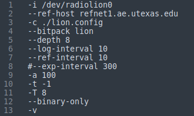

.. _pprx:
===================================
Precise Positioning Receiver (pprx)
===================================

This page describes how to configure, run, and interpret output from pprx, which is an implementation of GRID, the General Radionavigation Interfusion Device.

Editing Options Files
---------------------
pprx is highly configurable via both command-line options and configuration parameters. Type ``pprx --help`` to see a list of command-line options. These options are specified in a ``.opt`` file as seen in the example below:

Editing Configuration Parameters
--------------------------------
pprx configuration files are broken into configuration blocks. The start of each block is indicated by a block header, e.g., ESTIMATOR. A pprx ``.opt`` file (i.e. pprx.opt) has a corresponding configuration file,``.config`` (i.e. pprx.config). See this :download:`*example* configuration file <./../../../src/runtime_files/pprx.config>` for pprx.

Each block in the ``pprx.config`` file contains various configuration parameters. See each block below to view all of its configuration parameter choices and if applicable the choices for each parameter:

.. toctree::
   :maxdepth: 1

   pprx_config_blocks/basetime
   pprx_config_blocks/frontend
   pprx_config_blocks/bufferloader
   pprx_config_blocks/bank
   pprx_config_blocks/estimator
   pprx_config_blocks/display

How to Run
----------

**Examining** ``--help`` **Documentation**
Running the following command

.. code-block:: bash
   
   pprx --help

will show all the command-line options available for pprx, including a brief description of each.  

**Running pprx**
Suppose ``pprx.opt`` is a properly-formatted pprx options file as described :ref:`Editing Options Files`. Navigate to the directory where this file is located and type the following command into the terminal window.

.. code-block:: bash

   pprx -f pprx.opt
