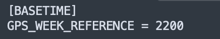

.. _basetime:
========
BASETIME
========
The BASETIME consists of the following configuration:

GPS_WEEK_REFERENCE
------------------
**Default:** N/A

**Definition:** GPS Week #. See `here <https://www.ngs.noaa.gov/CORS/Gpscal.shtml>`_