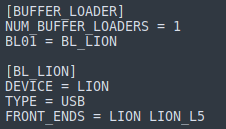

.. _bufferloader:
=============
BUFFER_LOADER
=============
The buffer-loader bank consists of the following configurations:

NUM_BUFFER_LOADERS
------------------
How many buffer loaders you have. One RadioLion = 1 Buffer Loader.

BL01
----
``BL_LION`` corresponds to buffer loader 1, with device LION.

DEVICE
------
``LION`` corresponds to the device name.

TYPE
----
Operational modes. Select from the following options:

* ``FILE``: Post-process capture files
* ``USB``: Support live capture operations

FRONT_ENDS
----------
``LION LION_L5`` corresponds to the RadioLion.