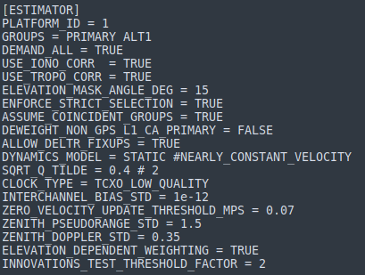

.. _estimator:
=========
ESTIMATOR
=========
The estimator bank consists of the following configurations:

PLATFORM_ID
-----------
Identifier of the receiver platform.

ENFORCE_STRICT_SELECTION
------------------------
Allow only phase-error-free signals with a steady-state DLL to participate in the estimation solution.

USE_IONO_CORR
-------------
Set true to correct for ionospheric delay when estimating the state

USE_TROPO_CORR
--------------
Set true to correct for tropospheric (neutral atmospheric) delay when estimating the state

ALLOW_DELTR_FIXUPS
------------------
Indicates whether to allow fixups to set Observables:tOffset so that receiver time remains close to true time.

ELEVATION_MASK_ANGLE_RAD
------------------------
Elevation mask angle, in radians.  Signals arriving at the receiver from transmitters below the elevation mask angle will be excluded from the estimation solution. Set to -PI/2 to prevent elevation masking. In the receiver config file, the elevation mask angle is given in degrees as ``ELEVATION_MASK_ANGLE_DEG``.

BORESIGHT_ELEVATION_MASK_ANGLE_RAD
----------------------------------
Boresight-relative elevation mask angle, in radians. See :ref:`ELEVATION_MASK_ANGLE_RAD`.

MAX_ABS_DELTR_SEC
-----------------
Maximum permitted absolute value of receiver clock bias relative to true GPS time, expressed in seconds.  If, due to clock drift or initialization error, the absolute value of receiver clock bias exceeds this value, a receiver clock fixup will be triggered.  As part of this clock fixup, concomitant changes to pseudorange and carrier phase observables will be made to keep the observables consistent, as required by the RINEX standard (See RINEX discussion under "DEFINITION OF THE OBSERVABLES"). Larger values of MAX_ABS_DELTR_METERS will lead to less frequent clock fixups.  Due to constraints in how the fixup is performed and to avoid overflow in the carrier phase container, MAX_ABS_DELTR_SEC must satisfy the following inequality: DELTR_FIXUP_RESOLUTION_SEC() <= MAX_ABS_DELTR_SEC <= DELTR_FIXUP_MAX_SEC()

INNOVATIONS_TEST_THRESHOLD_FACTOR
---------------------------------
Innovations testing within Estimator is based on the inner product of the normalized innovations vector, dzr = dot(zr, zr), which under a consistent estimator is chi-square distributed with zr.n_elem degrees of freedom. The threshold for excluding a set of measurements is taken as the factor below multipled by zr.n_elem.

CLOCK_TYPE
----------
Assumed receiver clock model. Select from the following options:

* ``TCXO_LOW_QUALITY``
* ``TCXO``
* ``OCXO_LOW_QUALITY``
* ``OCXO``

DYNAMICS_MODEL
--------------
Assumed antenna motion model. Select from the following options:

* ``STATIC``
* ``NEARLY_CONSTANT_VELOCITY``
* ``NEARLY_CONSTANT_ACCELERATION``
* ``LOW_EARTH_ORBIT``
* ``IMU_BASED``

SQRT_Q_TILDE
------------
The process noise for all dynamics models is expressed in terms of ``SQRT_Q_TILDE``, the square root of the noise intensity. See Bar Shalom "Estimation with Applications to Tracking and Navigation" sections 6.2.1 to 6.2.3 for details. The units of ``SQRT_Q_TILDE``are as follows for each dynamics model:

* STATIC                          meters/sqrt(sec)
* NEARLY_CONSTANT_VELOCITY        meters/sqrt(sec^3)
* NEARLY_CONSTANT_ACCELERATION    meters/sqrt(sec^5)

``SQRT_Q_TILDE`` represents the standard deviation of error induced on position, velocity, or acceleration state elements by the process noise over a 1-second propagation step.  The standard deviation corresponding to a T-second step is then approximated as sigmaX = sqrt(T)*``SQRT_Q_TILDE`` (see, e.g., Eq. 6.22-13 in Bar Shalom). This approximation is valid for short T; for long T, one needs to take multiple short propagation steps.

INIT_VELOCITY_STD
-----------------
At initialization, velocity and acceleration will be constrained because they are not immediately observable. Those constraints will assume a zero-mean Gaussian distribution with the provided standard-deviation for each scalar element.

Standard deviation of initialization velocity, in meters/sec.

INIT_ACCELERATION_STD
---------------------
Standard deviation of initialization acceleration, in meters/sec^2.

INTERCHANNEL_BIAS_STD
---------------------
Applicable only to the multi-antenna Estimator, ``INTERCHANNEL_BIAS_STD`` represents the standard deviation of error induced on the interchannel biases of the ALT channels relative to the primary channel by the process noise over a 1-second propagation step.  In the multi-antenna Estimator, each of the primary and ALT channels have their own receiver-clock offsets that are mutually correlated through a common receiver-clock offset rate. When set to 0, a single receiver-clock offset (and rate) will be used for all channels. The units of ``INTERCHANNEL_BIAS_STD`` are seconds/sqrt(sec).

ZENITH_PSEUDORANGE_STD
----------------------
Standard deviation of pseudorange measurements assuming a transmitter at zenith, in meters.

ZENITH_DOPPLER_STD
------------------
Standard deviation of Doppler measurements assuming a transmitter at zenith, in Hz.

ELEVATION_DEPENDENT_WEIGHTING
-----------------------------
Assert to weight observables by 1/sin(el), where el is the elevation angle.  This has the effect of de-weighting multipath-corrupted low-elevation signals.  If not asserted, all observables are weighted equally.

ASSUME_COINCIDENT_GROUPS
------------------------
Set true to treat all antennas specified in GROUPS as coincident and estimate only a single, common position (and velocity, acceleration, etc.). Set false to estimate independent positions for each antenna.

DEWEIGHT_NON_GPS_L1_CA_PRIMARY
------------------------------
Assert to de-weight all non-GPS_L1_CA_PRIMARY SignalTypes in the navigation solution.  The de-weighted signals types may still be incorporated into the solution, but they are de-weighted to the extent that their effect is negligible.  This de-weighting is useful for (1) resorting to a trusted GPS_L1_CA_PRIMARY-only navigation solution, and (2) examining the innovations of non-GPS_L1_CA_PRIMARY signals against a trusted GPS_L1_CA_PRIMARY-based solution.

GROUPS
------
Specify the antenna groups involved in estimation.

DEMAND_ALL
----------
Set true to register demand for all SignalTypes and TxIds. This is the default value and provides the legacy behavior of PpRx. Set false to register demand only for those Groups involved in estimation.

CONSTRAIN_ECEF_POSITION
-----------------------
Assert to constrain ECEF position to :ref:`KNOWN_ECEF_POSITION`. Only applicable when dynamics model is STATIC.

KNOWN_ECEF_POSITION
-------------------
Known ECEF position of L1 antenna phase center, in meters.

ZERO_VELOCITY_UPDATE_THRESHOLD_MPS
----------------------------------
If the norm of the estimated velocity vector is below this value, expressed in meters per second, then the estimator will assume that thevelocity is actually zero and update the state accordingly.

DELTR_FIXUP_RESOLUTION_SEC
--------------------------
This quantity is the time fixup resolution, in seconds.  A time fixup DELTR is always chosen to be an integer multiple of this quantity. This implies that ``DELTR_FIXUP_RESOLUTION_SEC`` must be chosen such that for any carrier frequency fc considered within the code, fc*DELTR_FIXUP_RESOLUTION_SEC is an integer number of cycles.