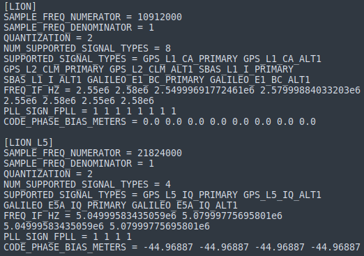

.. _frontend:
=========
FRONT-END
=========
The front-end bank consists of the following configurations:

SAMPLE_FREQ_NUMERATOR
---------------------
It is assumed that the sampling frequency of any RF front end supported by this code can be expressed in Hz as a ratio of two integers.  For example, the sampling frequency for the Zarlink/Plessey front end is 40e6/7 Hz, which would correspond to SAMPLE_FREQ_NUMERATOR = 40e6 and SAMPLE_FREQ_DENOMINATOR = 7. It is further assumed that double precision is sufficient to represent the time within a single interval of SAMPLE_FREQ_DENOMINATOR seconds.

SAMPLE_FREQ_DENOMINATOR
-----------------------
It is assumed that the sampling frequency of any RF front end supported by this code can be expressed in Hz as a ratio of two integers.  For example, the sampling frequency for the Zarlink/Plessey front end is 40e6/7 Hz, which would correspond to SAMPLE_FREQ_NUMERATOR = 40e6 and SAMPLE_FREQ_DENOMINATOR = 7. It is further assumed that double precision is sufficient to represent the time within a single interval of SAMPLE_FREQ_DENOMINATOR seconds.

QUANTIZATION
------------
The number of bits used in the front end's quantization scheme.

NUM_SUPPORTED_SIGNAL_TYPES
--------------------------
The number of signals desired to track. 

SUPPORTED_SIGNAL_TYPES
----------------------
An array listing the supported signal types. In the arrays that follow, data at the iith index correspond to the signal type at the iith index.

FREQ_IF_HZ
----------
Intermediate frequency of the signal, in Hz. See :download:`this python script <./../../../src/calc_fIF.py>` for how to calculate these numbers.

.. literalinclude:: ./../../../src/calc_fIF.py
    :linenos:
    :language: python
    :lines: 5-36

PLL_SIGN_FPLL
-------------
Indicates high (-1) or low (1) side mixing

CODE_PHASE_BIAS_METERS
----------------------
The bias below is the amount by which a biased pseudorange exceeds its bias-free representation. Typically, the bias for SignalType GPS_L1_CA is set to zero and all other SignalTypes are referenced to this.

